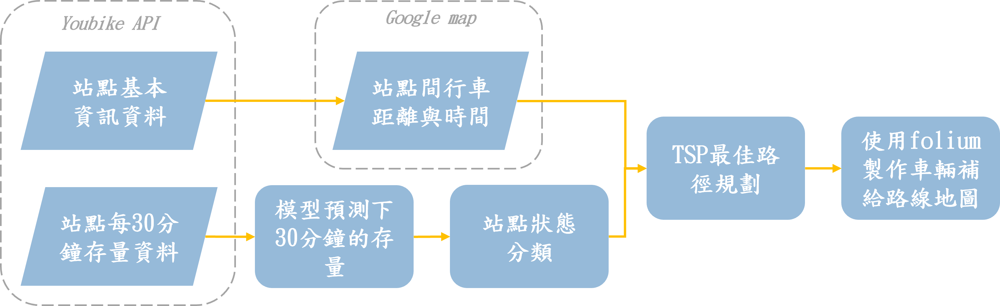

# NCCU_110_pytorch-and-ML_Prediction-of-bike-shortage
🎯 使用在交通的流量預測上很有名的 GMAN 模型，實作台北市 youbike 站點存量的預測。

🏫 本專案為 **NCCU-pytorch與機器學習(110)** 的課程實作報告。

💩 主要流程可查看 `scripts\pytorch_class_pipeline.sh` 裡的指令。

## Group member
|系級|學號|姓名|
|-|-|-|
|資科碩一|110753202|何彥南
|資科碩一|110753117|莊崴宇
|資科碩二|109753101|賴玠忠

## Quick Links
- [About](#about)
- [Quick Start](#quick-start)
- [Model code source](#model-code-source)
- [Citation](#citation)

## Application

<p align="center"></p>

## Quick Start
### Step1: Get youbike data
#### 爬取 youbike 資料
```
python sub_project/youbike_crawler/crawler.py --work_freq_in_min 10 --output_folder data/youbike_raw
```
#### 整理與合併資料
```
python sub_project/youbike_crawler/data_helper.py --crawler_output_folder data/youbike_raw --output_folder data/youbike_sort
```
- output
  - `data.csv`: 台北市所有站點不同時間存量資料。主要欄位為會隨時間變化的資訊(sbi,bemp,act,date,time)、站點的編號(sno)與所在區域(sarea)
  - `spot_info.csv`: 台北是所有站點資訊。(其他不會變資訊)

### Step2: prepare train data
```
data_helper.py --file_path data/youbike_sort/data.csv --output_folder 'data/train_data/' 
```
### Step3: prepare SE data
`on window`
```batch
python data_helper_SE.py ^
    --file_path data/youbike_sort/spot_info.csv ^
    --output_folder data/train_data/SE/basic ^
    --id_col sno ^
    --group_col sarea ^
    --group 文山區 ^
    --use_group True ^
    --longitude_col lng ^
    --latitude_col lat ^
    --adj_threshold 0.1
```
`on linux`
```shell
python data_helper_SE.py \
    --file_path data/youbike_sort/spot_info.csv \
    --output_folder data/train_data/SE \
    --id_col sno \
    --group_col sarea \
    --group 文山區 \
    --use_group True\
    --longitude_col lng \
    --latitude_col lat \
    --adj_threshold 0.1
```

### Step4: train GMAN model
python train.py --time_slot 10 --num_his 5 --num_pred 1 --batch_size 6 \
        --max_epoch 100 --patience 100 --learning_rate 0.001 \
        --traffic_file data/train_data/data.h5 \
        --SE_file data/train_data/SE/basic/SE.txt \
        --model_file ./output/basic/model.pkl \
        --log_file ./output/basic/log.txt \
        --output_folder ./output/basic \
        --device gpu
        
## Model code source
https://github.com/VincLee8188/GMAN-PyTorch
## Citation
This version of implementation is only for learning purpose. For research, please refer to  and  cite from the following paper:
```
@inproceedings{ GMAN-AAAI2020,
  author = "Chuanpan Zheng and Xiaoliang Fan and Cheng Wang and Jianzhong Qi"
  title = "GMAN: A Graph Multi-Attention Network for Traffic Prediction",
  booktitle = "AAAI",
  pages = "1234--1241",
  year = "2020"
}
```
